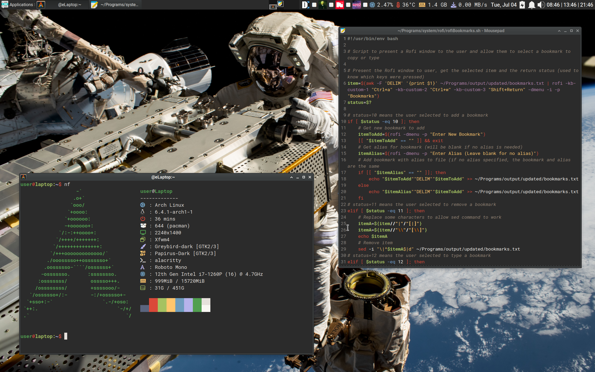
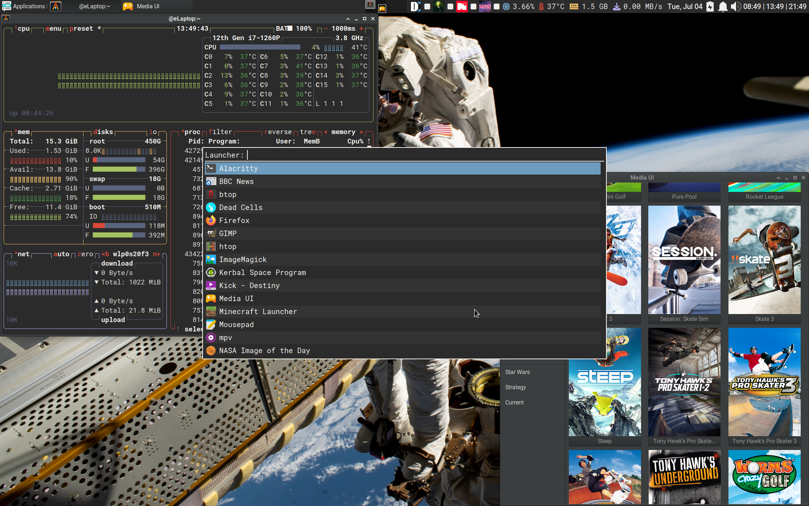
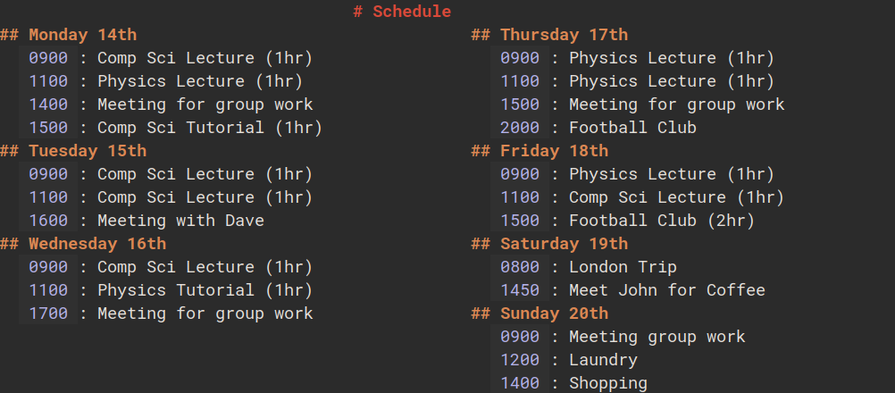

# XFCE 4 Config

## Screenshots 

## Installation 

### Dependancies

Install Arch: 

Guide: [Arch Install Guide](configure/archInstallGuide.md)

Installed when installing programs:

`sudo pacman -S papirus-icon-theme xfce4-genmon-plugin mousepad xfce4-screenshooter firefox rofi sassc unzip thunar-archive-plugin man xfce4-pulseaudio-plugin meson ninja python-pip gcc imagemagick xclip bc xdg-utils base-devel trash-cli libxtst pkg-config libqalculate btop htop make bat ncdu duf mpv ffmpeg mediainfo yt-dlp hyperfine xdotool aspell-en songrec pavucontrol alsa-firmware sof-firmware glow jq intel-gpu-tools intel-media-driver progress ristretto neofetch gimp expect pass fuse alacritty gnome-keyring rsync go ttf-droid perl-image-exiftool cmus man-pages moreutils perl-rename bash-completion tokei dust cool-retro-term xfce4-screensaver network-manager-applet zbar speedtest-cli ttf-roboto ttf-roboto-mono pipewire pipewire-pulse python-pillow audacity strace valgrind net-tools zathura  zathura-pdf-mupdf zathura-ps feh pulsemixer xcolor wmctrl python-mutagen python-requests python-pandas geany python-pipx nethogs pinta words noto-fonts noto-fonts-emoji noto-fonts-extra hspell nuspell libvoikko hunspell hspell`

Also needed:  
* [Greybird Dark Theme](https://github.com/shimmerproject/Greybird)
* [Font Awesome Free For Desktop](https://fontawesome.com/download)
* [ksuperkey](https://github.com/hanschen/ksuperkey)
* [Dragon Terminal Drag and Drop](https://github.com/mwh/dragon) 
* [Cava](https://github.com/karlstav/cava)

Wallpapers are mainly from here:  
[NASA Image of the Day](https://www.nasa.gov/multimedia/imagegallery/iotd.html)

### Setup 

Clone this repositry into a folder named `~/Programs`  
Run `~/Programs/configure/dotfilesInit.sh` file  
Run `~/Programs/configure/mousepadInit.sh` file  
There are scripts to automatically set Xfce settings, but xfconf-query is not reliable in my experience, so I tend to just do it manually. All of the Xfce4 keyboard settings and Xfwm keyboard settings can be found in the usage section below.  

**New Method:** 

These steps need to be performed when not logged into Xfce (press `Ctrl+Alt+F2` at login screen to switch to Arch inbuilt terminal)

(Where `YOUR_USERNAME` is your actual username, and `USERNAMEA` is just the string `USERNAMEA`)

`sed 's/USERNAMEA/YOUR_USERNAME/g' ~/Programs/configure/save.sh > ~/Programs/configure/save2.sh`  
`chmod +x ~/Programs/configure/save2.sh`  
`sed 's/OUTPUTUSERNAME/YOUR_USERNAME/g' ~/Programs/configure/xfceInit.sh > ~/Programs/configure/xfceInit2.sh`  
`chmod +x ~/Programs/configure/xfceInit2.sh`  
`./xfceInit2.sh`  
`reboot`

If config has been changed and you want to save it, run `./save2.sh`

**Old Setup:**

The setup for the panel can be found in [panelSetup.md](configure/panelSetup.md)  
Add ksuperkey to the startup applications  
In Appearance, Select Greybird-dark in Style, Papirus-Dark in Icons, `Roboto Regular 12` as Default Font, `Roboto Mono Regular 13` as Default Monospace Font  
For my laptop, anti-aliasing looks best when set to `Hinting: Slight` and `Sub-pixel order: RGB`  
In Xfwm Settings, set Style to Default and Title Font to `Roboto Bold 12`

## Usage 

[See README in configure folder for exact usage details](configure/README.md)

Includes dotfiles to configure some programs, as well as a bunch of my custom scripts. 

### Schedule 

A Go script allowing viewing and adding to a schedule in the terminal.  
Events can be added as such: `schedule -a 1500 thu "Meeting With John"`  
Running `schedule` will display this weeks schedule:  

## Archive 

In the `archive/publicCodeArchive` folder are old scripts, could still be useful for something.  
